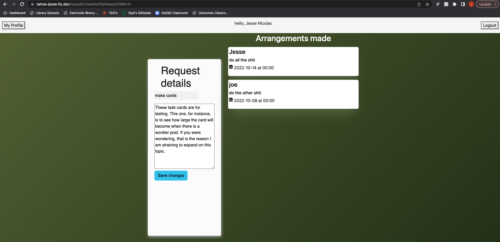
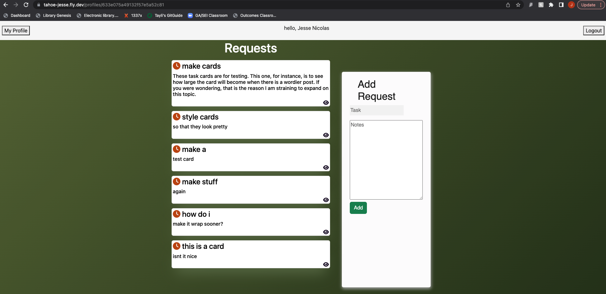
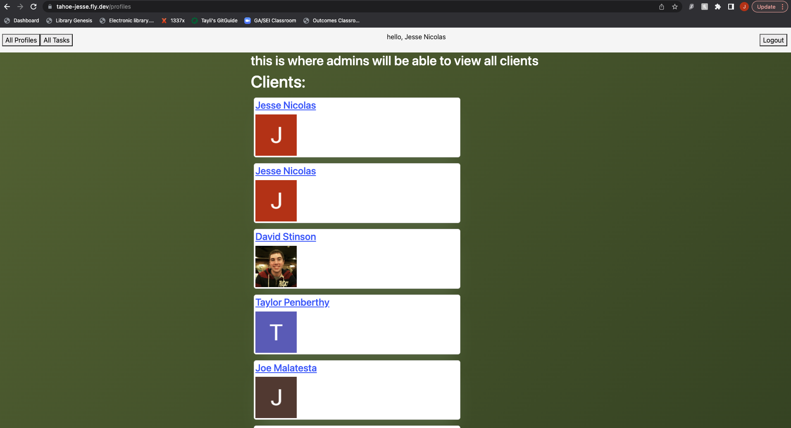
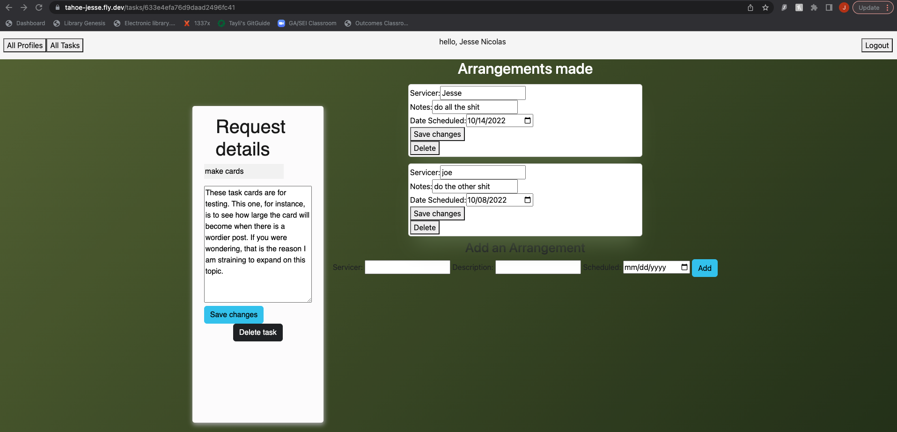

# TahoeJesse
TahoeJesse is a client portal and task management app for a property management service in the greater Lake Tahoe area.
Clients can log in with google Oauth and will be redirected to their profile page, where they can add tasks they'd like to have done at their vacation home. Having some handyman experience, Jesse has an eye for quality work and is commited to ensuring his clients recieve excellent service at an excellent value. 

### [Deployed Site](https://tahoe-jesse.fly.dev)
### [Trello Board (project planning)](https://trello.com/b/dT0TrY4S/tahoejesse)

## Technologies Used
- HTML
- CSS
- JavaScript
- EJS
- Express
- Node
- MongoDB
- Mongoose
- Google Oauth

## Credits
- [Atlas Cloud(MongoDB)](https://www.mongodb.com/)
- [Coolors](https://coolors.co/)
- [Bootstrap](https://getbootstrap.com/)
- [Font Awesome](https://fontawesome.com/)
- [Icons8](https://icons8.com/)

### IceBox
- "clock in/clock out" time tracker on assignments. log/total on task and profile views
- twilio web api for text alerts
- google calendar support for syncing arrangements to clients' google calendars
- add finished/unfinished toggle for both requests and arrangements
- refactor arrangements as referenced resource
- photo support for documenting recipts from contractors
- show client names in task view. link client profiles on task show (for admins)
- create messages resource. w/ clients' proile.id attached to each so the correct message history can be rendered 